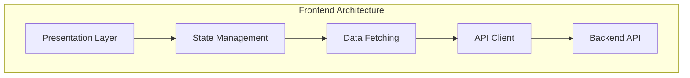

<div align="center">
  <br />
  <h1>
    
    <br>
    Bob's Corn Frontend
  </h1>
  <h3>Premium E-commerce Platform with Fair Commerce Policy</h3>
  <p>
    <strong>"Maximum 1 corn purchase per client per minute"</strong>
  </p>
  <br>
</div>

<div align="center">

[](https://nextjs.org/)
[](https://www.typescriptlang.org/)
[](https://mui.com/)

</div>

<div align="center">
  <p>
    <a href="#-quick-start"><strong>Quick Start</strong></a> •
    <a href="#-features"><strong>Features</strong></a> •
    <a href="#-tech-stack"><strong>Tech Stack</strong></a> •
    <a href="#-documentation"><strong>Docs</strong></a> •
    <a href="#-demo"><strong>Live Demo</strong></a>
  </p>
</div>

---

## 📋 Table of Contents

- [About](#-about)
- [Demo](#-demo)
- [Features](#-features)
- [Quick Start](#-quick-start)
- [Project Structure](#-project-structure)
- [Architecture](#-architecture)
- [API Documentation](#-api-documentation)
- [Performance](#-performance)
- [Deployment](#-deployment)

## 🌟 About

**Bob's Corn Frontend** is a modern, production-ready e-commerce platform that implements a unique fair commerce policy. Built with performance, accessibility, and user experience in mind, this application demonstrates enterprise-level architecture patterns and best practices.

### 🎯 Core Business Rule

> Bob believes in fairness. Our platform enforces a **"1 corn per minute"** purchase limit, ensuring equitable access to premium corn products for all customers. This unique rate-limiting feature is gracefully handled throughout the application with clear user feedback.

## 🎬 Demo

<div align="center">
  <h3>🌐 Live Environment</h3>
  <p>
    <a href="https://bobscorn.isalab.me"><strong>Production</strong></a> •
  </p>
</div>

## ✨ Features

### 🛒 E-commerce Core
- **Product Catalog**: Browse our premium corn selection with advanced filtering
- **Smart Cart**: Real-time updates with quantity management and price calculations
- **Secure Checkout**: Authentication-protected purchase flow
- **Order History**: Complete purchase tracking and order management
- **Product Search**: Lightning-fast search with autocomplete
- **Category Navigation**: Intuitive product organization

### 🔐 Security & Authentication
- **JWT Authentication**: Industry-standard token-based security
- **Protected Routes**: Secure pages requiring authentication
- **Session Management**: Persistent sessions with automatic refresh
- **Auto-logout**: Automatic cleanup on unauthorized access
- **XSS Protection**: Built-in React security measures

### ⚡ Performance & UX
- **Rate Limit Handling**: Graceful handling of the "1 corn/minute" rule with clear user feedback
- **Optimistic Updates**: Instant UI feedback for better perceived performance
- **Loading States**: Beautiful skeleton screens and progress indicators
- **Error Boundaries**: Graceful error recovery with helpful messages
- **Responsive Design**: Mobile-first approach with tablet and desktop optimization
- **Image Optimization**: Lazy loading, WebP support, and responsive images
- **Code Splitting**: Route-based splitting for faster initial loads

### 🎨 Design System
- **Material Design**: Latest Material UI components
- **Dark Mode**: System-aware and manual theme switching
- **Custom Theme**: Bob's Corn brand colors and typography

## 🛠️ Tech Stack

<div align="center">

| | Technology | Version | Description |
|:---:|:---|:---:|:---|
|  | **[Next.js](https://nextjs.org/)** | `15.5` | React framework with SSR/SSG |
|  | **[React](https://react.dev/)** | `19.1` | UI library |
|  | **[TypeScript](https://www.typescriptlang.org/)** | `5.0` | Type-safe JavaScript |
|  | **[Material-UI](https://mui.com/)** | `7.3` | Component library |
|  | **[Zustand](https://zustand-demo.pmnd.rs/)** | `5.0` | State management |
|  | **[TanStack Query](https://tanstack.com/query)** | `5.90` | Data fetching |
|  | **[Emotion](https://emotion.sh/)** | `11.14` | CSS-in-JS |
|  | **[Zod](https://zod.dev/)** | `4.1` | Schema validation |

</div>

### 🔧 Development Tools

- **Build**: [Turbopack](https://turbo.build/pack) - Rust-based bundler
- **Linting**: [Biome](https://biomejs.dev/) - Fast formatter/linter

## 🚀 Quick Start

### Prerequisites

- **Node.js** 18.0+ ([Download](https://nodejs.org/))
- **npm** 9.0+ / **yarn** 1.22+ / **pnpm** 8.0+
- **Git** 2.0+

### 🎯 Installation

```bash
# Clone the repository
git clone https://github.com/yourusername/bobs-corn-frontend.git
cd bobs-corn-frontend

# Install dependencies
npm install

# Set up environment variables
cp .env.example .env.local

# Start development server
npm run dev
```

### ⚙️ Environment Variables

```env
# .env.local
NEXT_PUBLIC_API_BASE=http://localhost:4000/api
NEXT_PUBLIC_SITE_URL=http://localhost:3000
NEXT_PUBLIC_SENTRY_DSN=your_sentry_dsn_here
NEXT_PUBLIC_GA_ID=your_google_analytics_id
```

### 📜 Available Scripts

| Command | Description |
|---------|-------------|
| `npm run dev` | Start development server (port 3000) |
| `npm run build` | Build for production |
| `npm run start` | Start production server |
| `npm run lint` | Run linting checks |
| `npm run format` | Format code with Biome |
| `npm run test` | Run test suite |
| `npm run test:e2e` | Run end-to-end tests |
| `npm run analyze` | Analyze bundle size |

## 📁 Project Structure

```
bobs-corn-frontend/
├── 📂 app/
│   ├── 📂 components/
│   │   ├── home/              # Homepage components
│   │   ├── product/           # Product components
│   │   └── shared/            # Shared components
│   ├── 📂 lib/
│   │   ├── api.ts             # API client
│   │   ├── config.ts          # Configuration
│   │   ├── queries.ts         # React Query hooks
│   │   └── utils.ts           # Utilities
│   ├── 📂 store/
│   │   ├── auth.ts            # Auth store
│   │   └── cart.ts            # Cart store
│   ├── (routes)/              # Page routes
│   ├── layout.tsx             # Root layout
│   └── page.tsx               # Homepage
├── 📂 public/                 # Static assets
├── 🔧 Configuration Files
│   ├── next.config.ts         # Next.js config
│   ├── tsconfig.json          # TypeScript
│   ├── biome.json             # Code quality
│   └── package.json           # Dependencies
└── README.md                  # You are here!
```

## 🏛️ Architecture

### Layered Architecture



### Rate Limiting Implementation

```typescript
// Frontend gracefully handles 429 responses
catch (err: any) {
  if (err?.status === 429) {
    toast("Please wait! Bob's policy: Maximum 1 corn purchase per minute.");
  }
}
```

## 📖 API Documentation

### Authentication Endpoints

| Method | Endpoint | Description |
|--------|----------|-------------|
| `POST` | `/api/auth/login` | User login |
| `POST` | `/api/auth/signup` | User registration |
| `GET` | `/api/auth/me` | Get current user |
| `POST` | `/api/auth/logout` | Logout user |

### Product Endpoints

| Method | Endpoint | Description |
|--------|----------|-------------|
| `GET` | `/api/products` | List all products |
| `GET` | `/api/products/:slug` | Get product by slug |
| `GET` | `/api/products/featured` | Get featured products |
| `GET` | `/api/products/categories` | Get all categories |

### Order Endpoints

| Method | Endpoint | Description | Rate Limit |
|--------|----------|-------------|------------|
| `POST` | `/api/orders/purchase` | Create order | **1/min** 🌽 |
| `GET` | `/api/orders` | Get user orders | - |
| `GET` | `/api/orders/:id` | Get order details | - |

<details>
<summary><b>View example API responses</b></summary>

### Success Response (200)
```json
{
  "order": {
    "id": "ord_123",
    "items": [{"productId": "1", "quantity": 1}],
    "total": 5.99,
    "status": "completed"
  }
}
```

### Rate Limit Response (429)
```json
{
  "error": "Too Many Requests",
  "message": "Maximum 1 corn purchase per minute. Please wait.",
  "retryAfter": 60
}
```

</details>

## 🔑 Key Features

### 1. **Rate Limit Handling**
```typescript
// In CartSheet.tsx - Graceful rate limit handling
catch (err: any) {
  if (err?.status === 429) {
    toast("Please wait! Bob's policy: Maximum 1 corn purchase per minute.");
  }
}
```

### 2. **Authentication Flow**
- Automatic token injection in API calls
- Session persistence via localStorage
- Protected checkout process
- Auto-logout on 401 responses

### 3. **Shopping Cart**
- Real-time updates
- Per-item removal
- Quantity management
- Price calculations with proper decimal handling

### 4. **Data Fetching**
- Intelligent caching with React Query
- Background refetching
- Optimistic updates
- Request deduplication

## 🎨 UI/UX Decisions

### Design Principles
1. **Clean & Modern**: Minimalist design focusing on product visibility
2. **Responsive**: Mobile-first approach with desktop optimization
3. **Accessible**: ARIA labels, keyboard navigation, screen reader support
4. **Performance**: Lazy loading, code splitting, optimized images

### Component Library
- Material-UI for consistent, professional appearance
- Custom theme with Bob's Corn branding
- Loading skeletons for better perceived performance
- Toast notifications for user feedback

## 🔒 Security Considerations

1. **Token Storage**: JWT in localStorage (consider httpOnly cookies for production)
2. **XSS Protection**: React's built-in escaping
3. **Input Validation**: Zod schemas for runtime validation
4. **Authentication**: Required for purchases
5. **Rate Limiting**: Backend-enforced business rule

## 📈 Performance Optimizations

1. **Code Splitting**: Dynamic imports for routes
2. **Image Optimization**: Native lazy loading
3. **Bundle Size**: Tree-shaking, minimal dependencies
4. **Caching**: React Query's intelligent cache management
5. **Memoization**: React.memo, useMemo for expensive operations

## 🚢 Deployment

### Vercel (Recommended)
```bash
# Install Vercel CLI
npm i -g vercel

# Deploy
vercel
```

### Docker
```dockerfile
# Dockerfile example
FROM node:18-alpine
WORKDIR /app
COPY package*.json ./
RUN npm ci --only=production
COPY . .
RUN npm run build
EXPOSE 3000
CMD ["npm", "start"]
```

## 🔄 CI/CD Pipeline

### GitHub Actions Example
```yaml
name: CI
on: [push, pull_request]
jobs:
  test:
    runs-on: ubuntu-latest
    steps:
      - uses: actions/checkout@v2
      - uses: actions/setup-node@v2
      - run: npm ci
      - run: npm run lint
      - run: npm run build
      - run: npm test
```

## 📊 Monitoring & Analytics

### Recommended Tools
- **Error Tracking**: Sentry
- **Analytics**: Google Analytics, Mixpanel
- **Performance**: Web Vitals, Lighthouse
- **Uptime**: Pingdom, UptimeRobot

## 🤝 Contributing

### Code Style
- Follow existing patterns
- Use TypeScript strictly
- Add JSDoc comments for public APIs
- Write descriptive commit messages

### Pull Request Process
1. Create feature branch
2. Implement changes with tests
3. Update documentation
4. Submit PR with description
5. Address review feedback

## 📝 Technical Decisions Log

### Why Zustand over Redux?
- **Simplicity**: Less boilerplate, easier to understand
- **Performance**: No context providers, minimal re-renders
- **TypeScript**: First-class TypeScript support
- **Size**: ~8KB vs Redux Toolkit ~36KB

### Why TanStack Query?
- **Cache Management**: Intelligent, automatic cache invalidation
- **Developer Experience**: Excellent DevTools
- **Features**: Background refetching, optimistic updates, parallel queries
- **Performance**: Request deduplication, pagination support

### Why Material-UI?
- **Consistency**: Design system out of the box
- **Customization**: Theming support
- **Accessibility**: WAI-ARIA compliant
- **Community**: Large ecosystem, good documentation

## 📚 Additional Resources

- [Next.js Documentation](https://nextjs.org/docs)
- [Material-UI Documentation](https://mui.com)
- [TanStack Query Documentation](https://tanstack.com/query)
- [Zustand Documentation](https://zustand-demo.pmnd.rs)

## 👨‍💻 Author Notes

This project demonstrates:
- **Clean Architecture**: Clear separation of concerns
- **Modern Best Practices**: TypeScript, hooks, functional components
- **Production Readiness**: Error handling, loading states, edge cases
- **Performance Focus**: Optimizations throughout
- **User Experience**: Thoughtful UI/UX decisions
- **Code Quality**: Comprehensive documentation, consistent patterns
